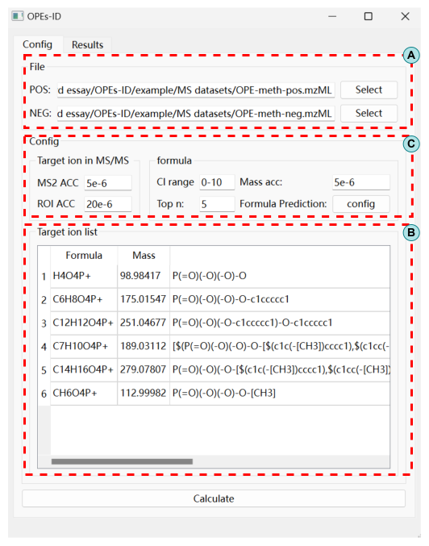
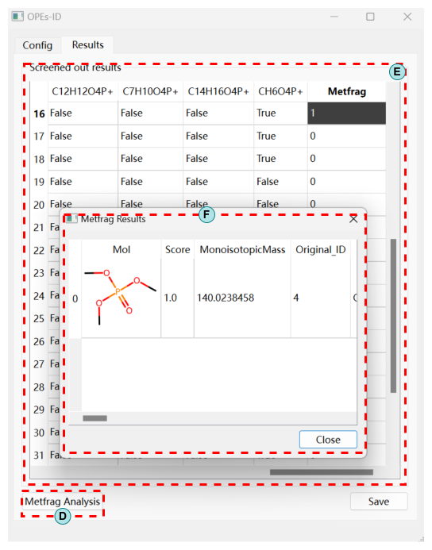

OPEs-ID
=======

OPEs-ID is a user-friendly software based on fragments-dependent nontargeted screening and in silico fragmentation scoring (provided by Metfrag), aiming to provide a one-stop solution for the identification of OPEs based on LC-HRMS DDA data. 

More refer to the paper "[OPEs-ID: A software for non-targeted screening of organophosphate esters based on liquid chromatography-high-resolution mass spectrometry](https://doi.org/10.1016/j.jhazmat.2023.133275)".


### Requirements
- Python >= 3.11
- Java >= 11 (Optional, For running Metfrag)

### Python dependencies

The list below is the version of Python dependencies used when developing the algorithm. Older versions might still work but are untested.

- joblib==1.3.2
- nest-asyncio==1.5.8
- numpy==1.26.2
- openpyxl==3.1.2
- pandas==2.1.4
- pymzml==2.5.2
- python-constraint==1.4.0
- rdkit==2023.9.3
- requests==2.31.0
- scipy==1.11.4
- tqdm==4.66.1
- Pyside6==6.6.1 (Optional for GUI)

### Install
Either copy the `OPEs_ID` directory in the repository to your working directory or install using `pip` by runing following command

```
pip install git+https://github.com/speakinside/OPEs-ID.git
```

or

```
pip install "OPEs_ID[gui] @ git+https://github.com/speakinside/OPEs-ID.git"
```

to install the optional dependency for running the simple GUI script shipping with `OPEs-ID`.

There is also a ready-to-use GUI package for Windows which can be downloaded [here](https://github.com/speakinside/OPEs-ID/releases).

### Using

#### As a python lib
To use `OPEs_ID` in a script or a python notebook. Please refer to the python notebooks in `example` directory.

#### As a GUI application
Run `OPEs_ID_gui.exe` or `python -m OPEs_ID.gui` to launch a simple gui for OPEs_ID.



1. Input the MzML file in Box A.
2. Set parameters for computation in Box C. 
    - MS2 ACC: Mass accuracy for MS2 feature search
    - ROI ACC: Mass accuracy for aggregating the precursors of the same chromatographic peak.
    - Cl range: The limit on the number of Cl atoms
    - Top n: The max number of peaks involved in chlorine isotope predictions
    - Mass acc: Mass accuracy for formula prediction
    - Formula Prediction: More detailed restriction on the elements for formula prediction
3. Click `Calculate` button to start searching and formula prediction 



4. After the first calculation, results will be shown in box E without the `Metfrag` column.
5. (Optional) Click `Metfrag Analysis` button to config and run Metfrag Analysis. After the operation, `Metfrag` column will show on far right and the number shown in each row in this column represents how many candidate structures.
6. (Optional) Double-Clicking an item in `Metfrag` column, a popup would show the detailed Metfrag results as in box F.
7. Click `Save` button to save all the results.

### Cite the paper

```bibtex
@article{XIONG2024133275,
    title = {OPEs-ID: A software for non-targeted screening of organophosphate esters based on liquid chromatography-high-resolution mass spectrometry},
    journal = {Journal of Hazardous Materials},
    volume = {465},
    pages = {133275},
    year = {2024},
    issn = {0304-3894},
    doi = {https://doi.org/10.1016/j.jhazmat.2023.133275},
    url = {https://www.sciencedirect.com/science/article/pii/S0304389423025591},
    author = {Yinran Xiong and Jinyue Liu and Jing Yu and Da Chen and Tiantian Li and Fengli Zhou and Ting Wu and Xiaotu Liu and Yiping Du},
    keywords = {Fragments-dependent screening, LC-HRMS, In silico fragmentation, Isotopic pattern matching, Organophosphate esters (OPEs)},
}
```

### Future work

- Add more annotations and typing hints to the code
- Optimize the logics of the GUI script